# Snapfall — architecture

This is the system **as it exists in the repo**, drawn from the code, not the PRD. Every box is a
real component; every edge is a real call or transaction. The unproven edges are marked as such —
a diagram that drew a working Gateway integration would be the first dishonest artifact in this
repo.

*Source of truth: [`architecture.mmd`](architecture.mmd) (Mermaid). Regenerate the image with
`npx @mermaid-js/mermaid-cli -i docs/architecture.mmd -o docs/architecture.svg -b white`. The SVG
is vector, so it drops cleanly into a slide or a PDF.*

## The line that is the whole product — local vs on-chain

Everything inside the yellow **LOCAL** box runs on the operator's own machine: the Brain that
scopes and routes jobs, the Workers that do the actual work, the policy/approval guard, the
Billing and Store, the Owner API, the Sidecar, and the Dashboard. **Keys and agent work never
leave that box.**

- **The Funding agent is the only signer.** It holds the sole references to the treasury key, the
  customer key, the x402 payment secrets, and the approval HMAC (`daemon/internal/funding`). It
  signs transactions **locally** and submits them; the *signed transaction* crosses to Arc, never
  the key.
- **Workers never touch money, keys, or the owner** (`daemon/internal/worker/worker.go` enforces
  this at the package boundary). A worker receives one assignment, produces a deliverable, and —
  if it needs to spend — sends a *request* that the policy guard gates and the Funding agent
  executes. The worker never signs. On the diagram it has **no edge to the chain side at all.**
- The only things that cross the boundary are **money** (the Funding agent's signed transactions)
  and a **content hash** (to AuditAnchor — a hash, never the deliverable). The Dashboard and
  Indexer *read* Arc directly over RPC, which is what makes the money independently verifiable
  without trusting the operator.

## Where the money moves, and in what order — the waterfall

The numbered edges trace one job end to end:

1. **① fund escrow** — the customer funds its own escrow into `JobVault` (customer lane, SC-JV-001).
2. **② requestAdvance** — the operator draws a receivables-secured advance from `FloatPool`
   against that escrow (treasury lane). The advance funds the work.
3. **③ acceptDelivery** — the customer accepts; one atomic transaction runs the fall:
4. **④ repayAdvance — POOL FIRST** — `JobVault.acceptDelivery` repays `FloatPool` (principal + fee)
   *before* it pays anyone else, and
5. **⑤ operator payout — SECOND** — only the remainder reaches the operator.

Pool-before-operator is contract control flow, not a convention (`acceptDelivery` calls
`repayAdvance` before `usdc.safeTransfer(operator, …)`), and it is proven on chain twice — see
[`addresses.md`](addresses.md) (§4 hand-driven, §7 from the first automated spine run).

## Circle and Arc surfaces — proven vs unproven

The legend is load-bearing:

| Marking | Meaning | On the diagram |
|---|---|---|
| **Green, solid** | Real and proven on chain | `JobVault`, `FloatPool`, `AuditAnchor`, **USDC** (Circle's stablecoin, Arc's native gas token) |
| **Orange, dashed** | Built but **never exercised against the live service** | The Gateway x402 facilitator client (`sidecar/src/facilitator.ts`) and Circle's Gateway endpoint. It reads `CIRCLE_API_KEY`, is coded against Circle's documented interface, and has never made a live call — the x402 payments rest at `NOT_BROADCAST`. See [`CIRCLE-FEEDBACK.md`](CIRCLE-FEEDBACK.md). |
| **Purple, dashed** | A disclosed **mock** | `MockUSYCStrategy` — the idle-capital sweep. USYC is permissioned; the mock moves real ERC-20 assets behind the real `IIdleCapitalStrategy` interface and never claims to be the product. |
| **Red** | Holds the keys | The Funding agent — the single signer, drawn red so the one component that can move value is unmistakable. |

The x402 agent-purchase path (`Funding → x402 buyer → paid seller → facilitator → Gateway`) is a
**real handshake with an unproven settlement**: the 402 → sign → 200 loop runs and the EIP-3009
authorization is real, but the broadcast that would settle it on Arc has never run. It is drawn
dashed from the seller onward for exactly that reason.
